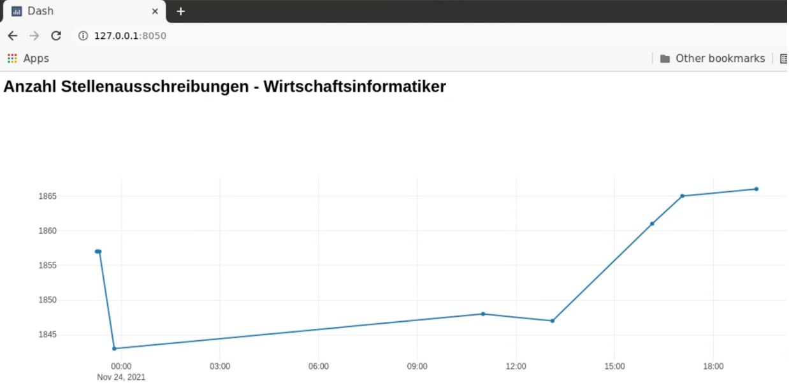
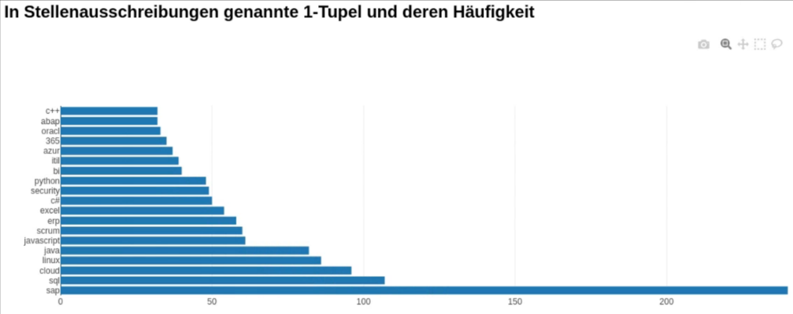
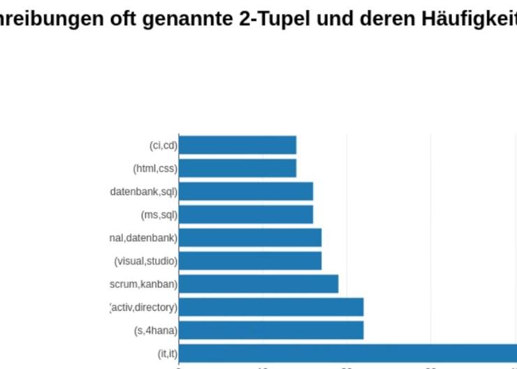
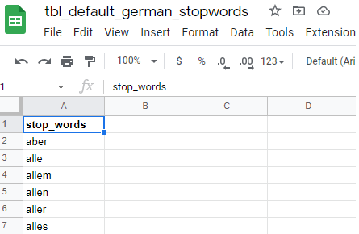

# **Text Mining with Python and Docker**
---
This application searches for *job postings* by a given *job title* and performs a *NLP analysis* to find the most commonly mentioned skills and qualifications in job listings. The results are saved to a postgres database and displayed in a dash plotly dashboard.


## Structure of the project
---

---
## Main packages used
---
| **web scraping** | **HTML Parser** | **extract data** | **database driver** | **NLP**              | **dashboard**     |
|------------------|-----------------|------------------|---------------------|----------------------|-------------------|
| beautifulSoup 4  | html5lib        | regex            | psycopg2            | NLTK                 | dash              |
| requests         | lxml            | json             | SQLAlchemy          | NLTK 'punkt package' | plotly.graph_objs |
| requests-html    |                 | pandas           |                     |                      |                   |

---
## How to start the application
---
Prerequisits: docker-cli (see docker-desktop on Windows) and docker-compose have to be installed. See also https://www.docker.com for further instructions.

Please notice:
- In contrast to *docker*, all *docker-compose* commands can only be executed in the root directory of the project where *'docker-compose.yml'* is located.
- The performance of the web scraping module is configured to ensure a stable webscraping in order to avoid IP blacklisting.

### Usefull Docker & Docker-Compose Commands

start docker-compose with build process
```bash
docker-compose up --build
```
start docker-compose in background
```bash
docker-compose up -d
```
shutdown of docker-compose
```bash
docker-compose down
```
display all running containers
```bash
docker ps
```
display running & stopped containers
```bash
docker ps -a
```
display all images
```bash
docker images
```
### restart a specific docker-compose container (service)
stop the 'dashboard' service
```bash
docker-compose stop dashboard
```
start the 'dashboard' service
```bash
docker-compose start dashboard
```
### Log on to docker-compose container and access Postgres DB 

log on to docker-compose container with service name 'db'
```bash
docker-compose exec db sh
```
switch to root-user
```bash
su -
```
log-in to postgres database called 'stepstone' & user 'postgres'
```bash
psql -d stepstone -U postgres
```
display all tables of the database
```bash
\dt
```
display content of table 'tbl_bigrams'
```bash
SELECT * FROM tbl_bigrams;
```

## Dashboard
---
The dashboard can be accessed on:
*127.0.0.1:8050*


 </br>
*Example 1:* Time series with count of job postings for job title 'Wirtschaftsinformatiker' 

</br>
*Example 2:* unigrams found for job title 'Wirtschaftsinformatiker' 

</br>
*Example 3:* Bigrams found for job title 'Wirtschaftsinformatiker'

## Configuation and download of data
---
The search term itself, the maximum number of search results used for the analysis, raw data of db-tables as well as the lists of stop words for unigrams, bigrams and trigrams can be accessed through the dashboard.</br> 
In this version the stop word lists are integrated via google sheets.

</br>
*Example 4:* Customizable german stopword sheet.

## Known issues
---
This application is a prototype and subject to continuous improvements.
A common issue is that the 'dashboard' container does not wait for the 'app' container to finish. Therefore some diagramms can remain empty.
Workaround: at the time the NLP analysis is done, stop the 'dashboard' service and start the 'dashboard' service again. 

Please also see 'Issues' section of this repo. 
