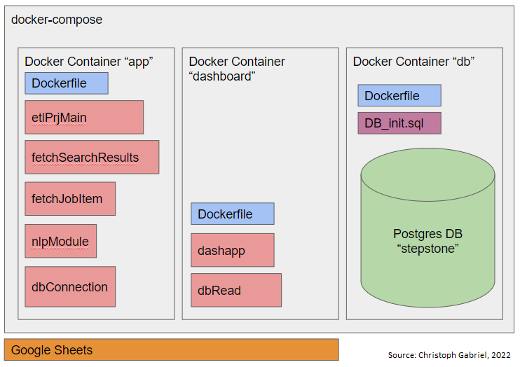

# **Job scraping with Python and Docker**
---
This application searches for job postings by a given job title and performs an NLP analysis to find the most commonly mentioned skills and qualifications in job listings. The results are saved to a postgres database and displayed in a dash plotly dashboard.

## Structure of the project
---

---
## How to start the application
---
As prerequisits docker-cli (docker-desktop on Windows) and docker-compose have to be installed. See also https://www.docker.com for further instructions.

- todo: table of commands and description.

|              |                                                                   |
|--------------|-------------------------------------------------------------------|
| Description: |  start-up with build process                                      |
| Command:     | docker-compose up --build                                         |
|              |                                                                   |
| Description: | start-up in background                                            |
| Command:     | docker-compose up -d                                              |
|              |                                                                   |
| Description: |  shutdown                                                         |
| Command:     | docker-compose down                                               |
|              |                                                                   |
| Description: |  display all running containers                                   |
| Command:     | docker ps                                                         |
|              |                                                                   |
| Description: |  display running & suspended containers                           |
| Command:     | docker ps -a                                                      |
|              |                                                                   |
| Description: |  display all images                                               |
| Command:     | docker images                                                     |
|              |                                                                   |
| Description: |  log-on to docker-compose container with service name 'db'        |
| Command:     | docker-compose exec db sh                                         |
|              |                                                                   |
| Description: |  switch to root-user                                              |
| Command:     | su -                                                              |
|              |                                                                   |
| Description: |  log-in to postgres database called 'stepstone' & user 'postgres' |
| Command:     | psql -d stepstone -U postgres                                     |
|              |                                                                   |
| Description: |  display all tables of the database                               |
| Command:     | \dt                                                               |
|              |                                                                   |
| Description: |  display content of table 'tbl_bigrams'                           |
| Command:     | SELECT * FROM tbl_bigrams;                                        |
|              |                                                                   |
| Description: |  stop the 'dashboard' service(container)                          |
| Command:     | docker-compose stop dashboard                                     |
|              |                                                                   |
| Description: |  start the 'dashboard' service(container)                         |
| Command:     | docker-compose start dashboard                                    |

## Known issues
---
This application is a prototype and subject to continuous improvement. 

A common issue is that the 'dashboard' container does not wait for the 'app' container to finish. Therefore some diagramms can remain empty.
_Workaround: 
